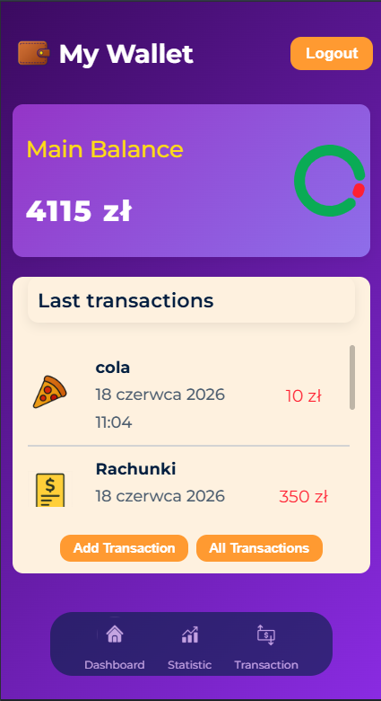
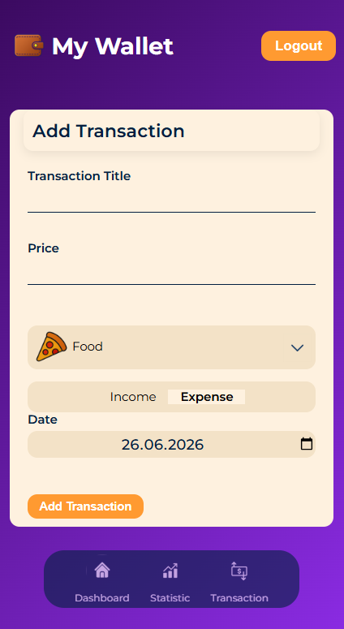
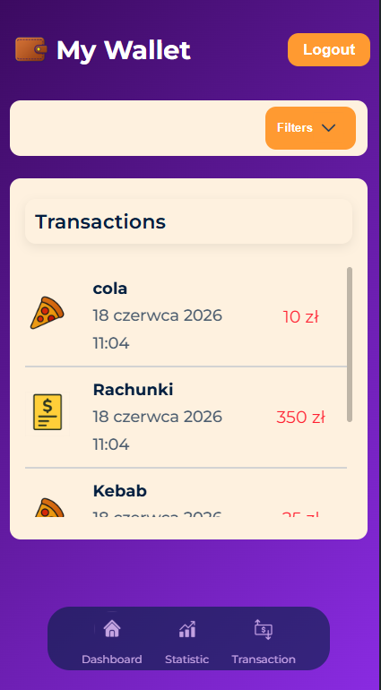
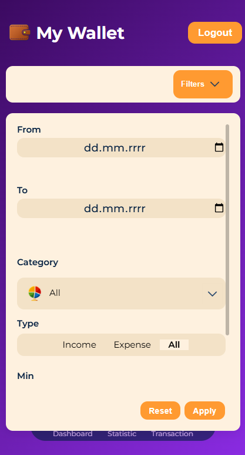

# 💳 My Wallet

A simple expense‑tracking app built with React, TypeScript, and Firebase.
The goal of the project is to practice clean component architecture, UI/UX patterns, and real‑world workflows such as forms, validation, filtering, and data persistence.

### 🚀 Live Demo

(coming soon)

### 🛠️ Tech Stack

- React
- TypeScript
- Firebase Firestore
- Styled Components
- Vite

### 📌 Features

- Add income and expense transactions
- Store data in Firebase (real‑time sync)
- Filter transactions by type, category, and date
- Responsive layout for mobile and desktop
- Clean and modular component structure

### 📅 Planned Features

- Editing and deleting transactions
- Monthly and yearly statistics
- Charts for income vs. expenses
- Category breakdown

### 🖼️ Screenshots

#### Dashboard


#### Add Transaction


#### Transactions


#### Mobile






### 🧪 Demo Account

Use this test account to explore the app without creating your own:

```bash
Email: demo@mywallet.app
Password: demo1234
```

### 🛠️ Run Locally

Clone the project

```bash
git clone https://github.com/AlbertKep/my-wallet
```

Install dependencies

```bash
npm install
```

Start the dev server

```bash
npm run dev
```

### 🎯 Learning Goals

- Component architecture
- State management patterns
- Firebase integration
- UI/UX for financial apps
- Clean and readable TypeScript
